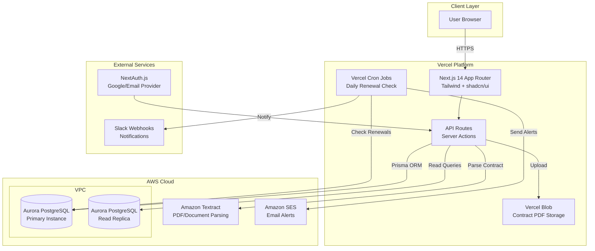
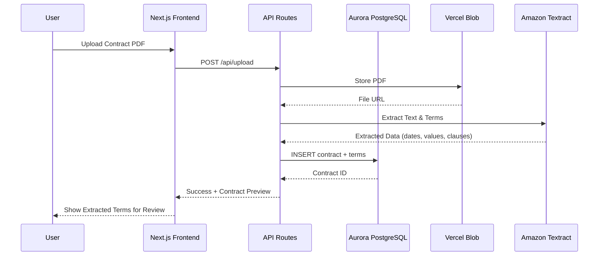
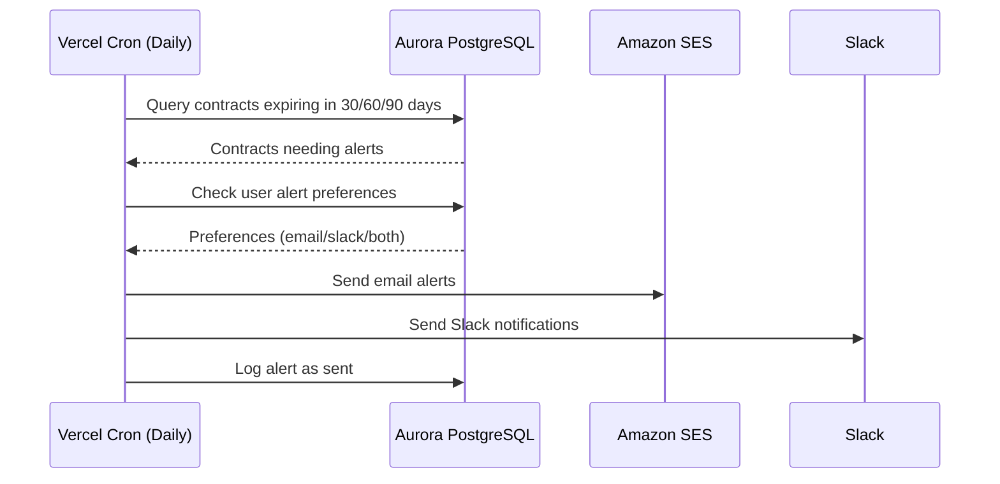
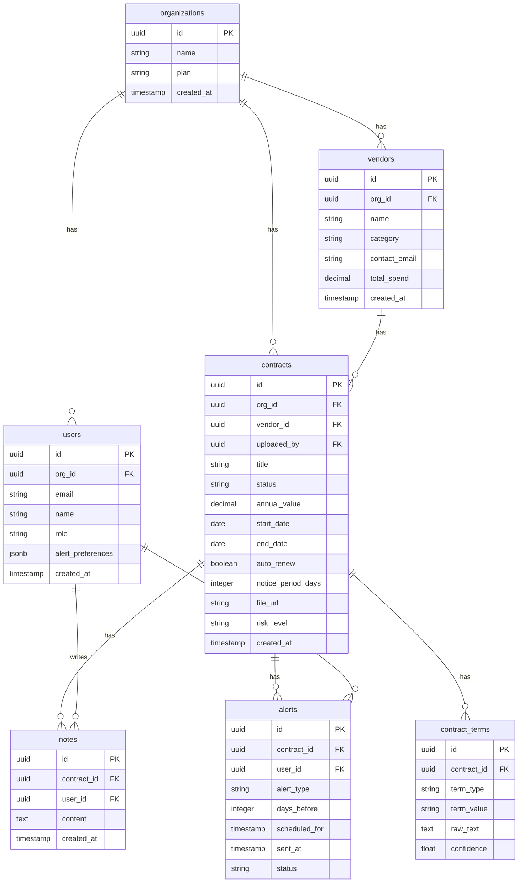

# ContractPulse — Architecture

## System Architecture Diagram

## Data Flow Diagram

## Alert Flow

## Database Schema (ER Diagram)

## Infrastructure Notes

- **Database:** Aurora PostgreSQL (Serverless v2 recommended for cost efficiency during hackathon)
- **Deployment:** Vercel (auto-deploy from GitHub main branch)
- **File Storage:** Vercel Blob (for contract PDFs)
- **AI Parsing:** Amazon Textract (AnalyzeDocument API)
- **Email:** Amazon SES (or Resend as simpler alternative)
- **Auth:** NextAuth.js with Google + Email magic link providers
- **ORM:** Prisma (type-safe, great DX, easy migrations)

## Scaling Considerations

- Aurora read replicas for dashboard analytics queries
- Prisma connection pooling via Vercel's edge config
- Vercel ISR for dashboard pages (revalidate every 60s)
- DynamoDB could be added later for high-frequency alert logs

## Why Aurora PostgreSQL?

1. **Serverless v2** — scales to zero during inactivity, cost-efficient for a SaaS product starting out
2. **PostgreSQL compatibility** — rich JSON support for alert preferences, full-text search for contract terms
3. **Production-grade** — same engine used by enterprises, automatic failover, point-in-time recovery
4. **Prisma integration** — first-class support with type-safe queries and migrations
5. **Read replicas** — can offload analytics queries as the product scales
