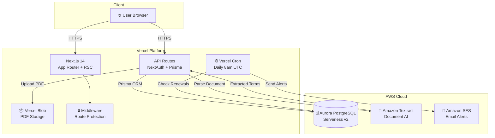
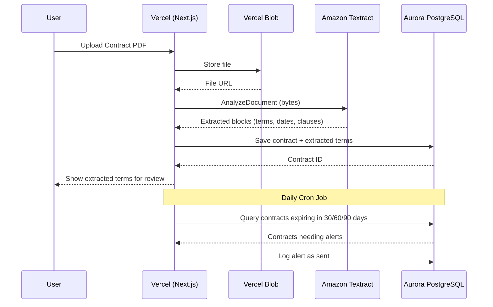
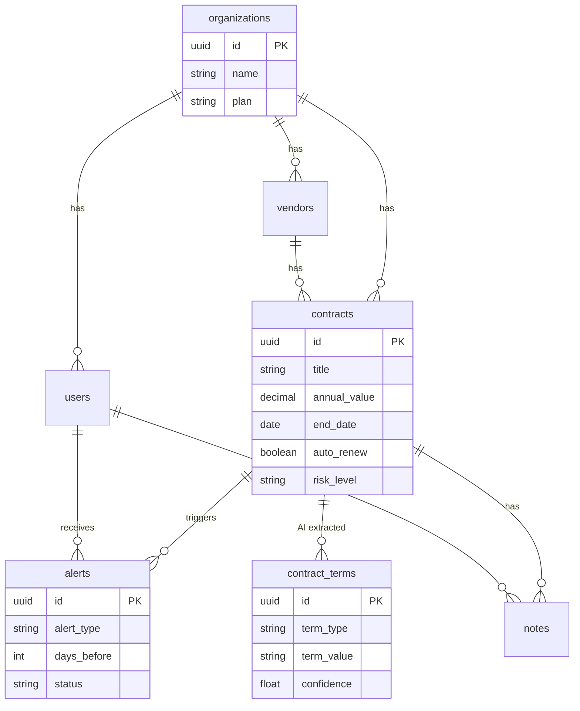

# ContractPulse — Architecture

## System Overview

## Data Flow

## Database Schema

## Tech Stack

| Layer | Technology | Purpose |
|-------|-----------|---------|
| Frontend | Next.js 14 + Tailwind + shadcn/ui | Server-rendered React UI |
| Auth | NextAuth.js (JWT) | Session management |
| ORM | Prisma | Type-safe database access |
| Database | **Aurora PostgreSQL Serverless v2** | Primary data store |
| File Storage | Vercel Blob | Contract PDF storage |
| AI | Amazon Textract | Document parsing & term extraction |
| Alerts | Amazon SES + Vercel Cron | Automated renewal notifications |
| Deployment | Vercel | CI/CD, edge network, cron jobs |

## Why Aurora PostgreSQL?

- **Serverless v2** — scales to near-zero during inactivity, cost-efficient for SaaS
- **PostgreSQL** — rich JSON support for preferences, full-text search for terms
- **Production-grade** — automatic failover, encryption at rest, point-in-time recovery
- **Prisma-native** — first-class support with type-safe queries
- **Scalable** — read replicas ready when the product grows
